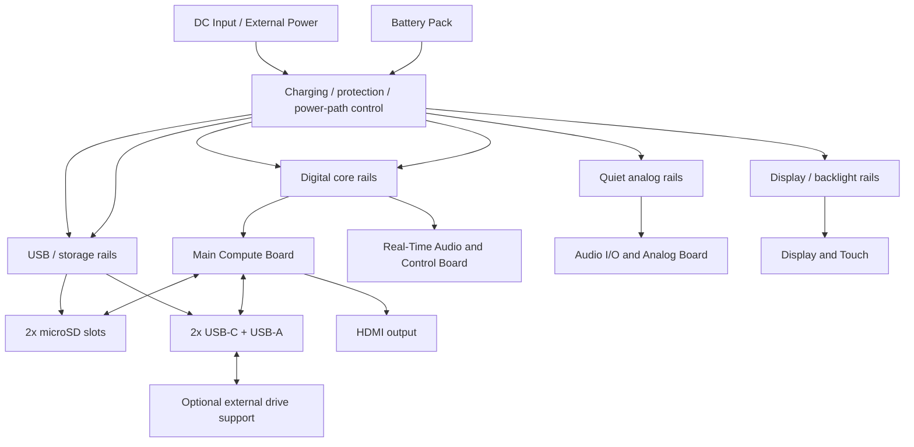

# IUS Power and Storage Overview
Revision B

## Power and storage Mermaid reference

```mermaid
flowchart TB
    DC[DC Input / External Power]
    BAT[Battery Pack]
    CHG[Charging / protection / power-path control]
    REG1[Quiet analog rails]
    REG2[Digital core rails]
    REG3[Display / backlight rails]
    REG4[USB / storage rails]

    UI[Main Compute Board]
    RT[Real-Time Audio and Control Board]
    AIO[Audio I/O and Analog Board]
    DISP[Display and Touch]
    STORE[2x microSD slots]
    USB[2x USB-C + USB-A]
    HDMI[HDMI output]
    EXT[Optional external drive support]

    DC --> CHG
    BAT --> CHG
    CHG --> REG1 --> AIO
    CHG --> REG2 --> UI
    CHG --> REG2 --> RT
    CHG --> REG3 --> DISP
    CHG --> REG4 --> STORE
    CHG --> REG4 --> USB
    UI <--> STORE
    UI <--> USB
    UI --> HDMI
    USB <--> EXT
```

